# Learning Guide: Multi-Agent Code Review System

This document explains the architecture, design patterns, and flow of the multi-agent code review system. By the end, you'll understand how to build agentic AI systems with parallel execution, provider abstraction, and synthesis patterns.

---

## Table of Contents

1. [Core Concepts](#core-concepts)
2. [Architecture Overview](#architecture-overview)
3. [End-to-End Flow](#end-to-end-flow)
4. [Provider Abstraction Pattern](#provider-abstraction-pattern)
5. [Agent Design Pattern](#agent-design-pattern)
6. [Parallel Execution with asyncio](#parallel-execution-with-asyncio)
7. [The Reviewer Agent: Synthesis Pattern](#the-reviewer-agent-synthesis-pattern)
8. [Prompt Engineering Patterns](#prompt-engineering-patterns)
9. [Error Handling Strategies](#error-handling-strategies)
10. [Key Takeaways](#key-takeaways)

---

## Core Concepts

### What is an Agentic System?

An **agentic system** is one where AI models act autonomously to accomplish tasks. Instead of a single prompt-response, agents:
- Have specialized roles and expertise
- Can be composed together (multi-agent)
- Make decisions based on context
- Produce structured outputs

### Multi-Agent vs Single-Agent

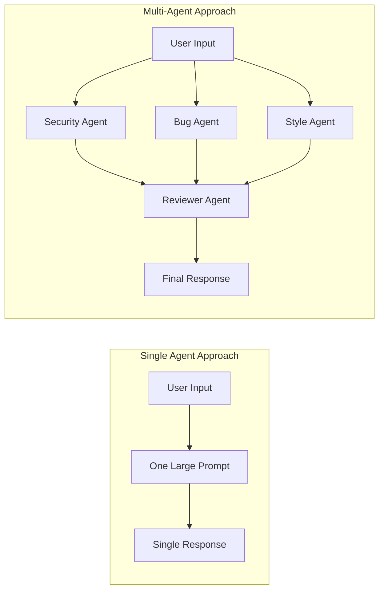

**Why Multi-Agent?**
| Aspect | Single Agent | Multi-Agent |
|--------|--------------|-------------|
| Specialization | Generic knowledge | Deep expertise per domain |
| Parallelism | Sequential | Concurrent execution |
| Cost | One expensive call | Multiple cheap calls + one synthesis |
| Reliability | Single point of failure | Graceful degradation |
| Maintainability | Monolithic prompt | Modular, testable prompts |

---

## Architecture Overview

### High-Level Components

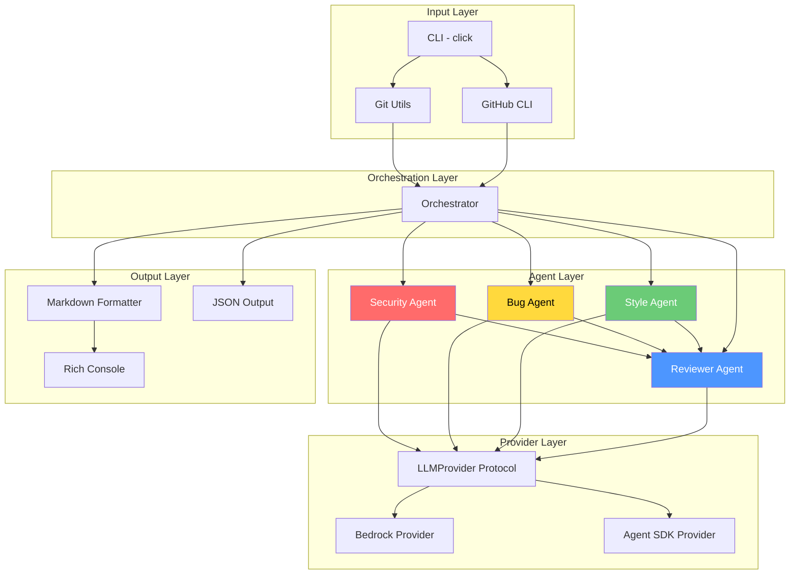

### Layer Responsibilities

| Layer | Responsibility | Key Files |
|-------|---------------|-----------|
| **Input** | Parse CLI args, fetch git diffs | `cli.py`, `git_utils.py` |
| **Orchestration** | Coordinate agents, manage flow | `orchestrator.py` |
| **Agent** | Specialized code analysis | `agents/*.py` |
| **Provider** | Abstract LLM calls | `providers/*.py` |
| **Output** | Format results | `output/markdown.py` |

---

## End-to-End Flow

### Complete Request Flow

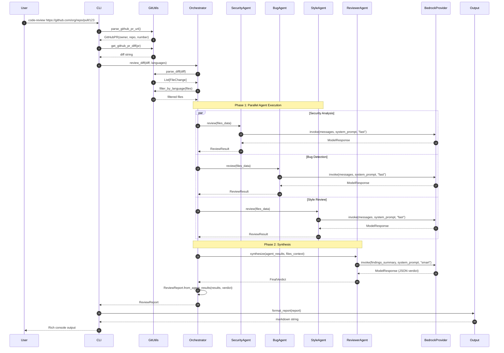

### Data Flow Through the System

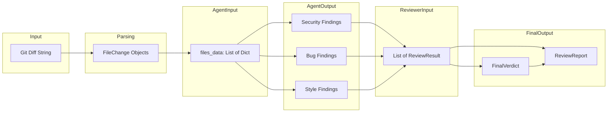

---

## Provider Abstraction Pattern

### Why Abstract the Provider?

The system is designed to work with multiple LLM backends:
- **AWS Bedrock** (current) - Production ready
- **Claude Agent SDK** (future) - Enhanced capabilities
- **Other providers** - OpenAI, local models, etc.

### The Protocol Pattern

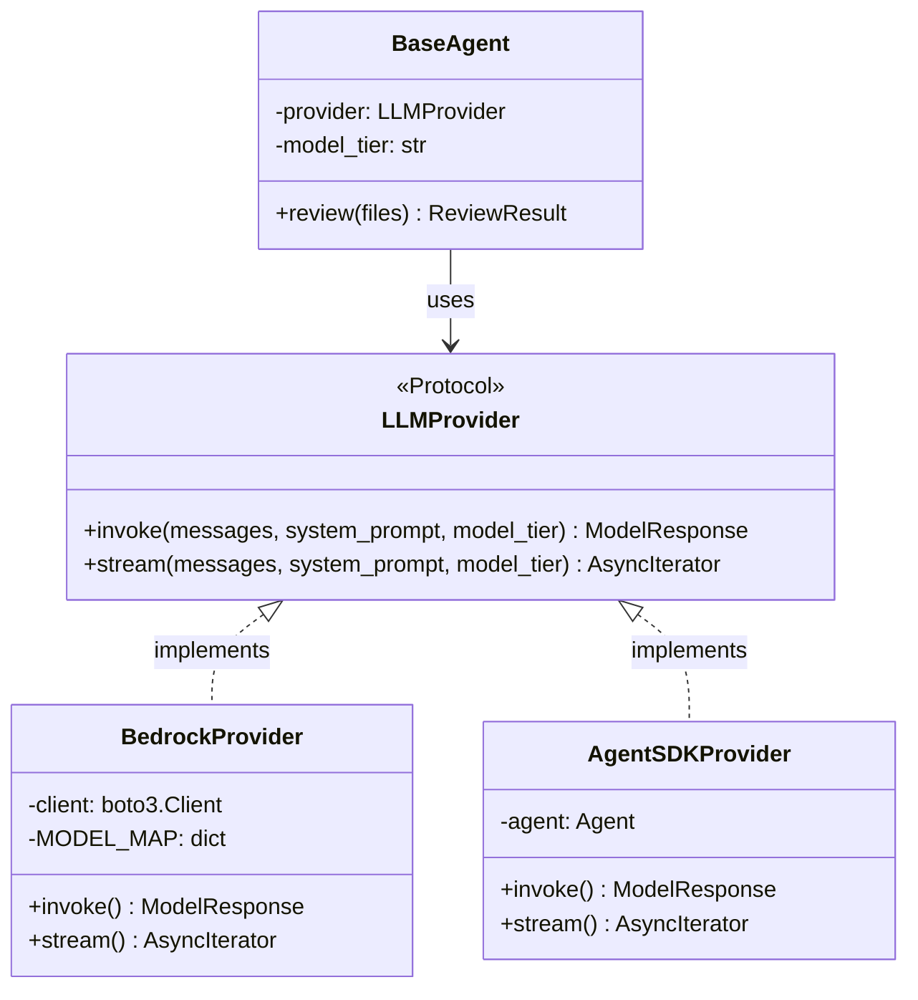

### Code Pattern

```python
# providers/base.py - The Protocol
from typing import Protocol

class LLMProvider(Protocol):
    """Protocol for LLM providers - any class with these methods works."""

    async def invoke(
        self,
        messages: list[Message],
        system_prompt: str,
        model_tier: str = "fast",
    ) -> ModelResponse:
        ...

# providers/bedrock.py - Implementation
class BedrockProvider:
    """Implements LLMProvider without explicit inheritance."""

    MODEL_MAP = {
        "fast": "us.anthropic.claude-haiku-4-5-20251001-v1:0",
        "smart": "us.anthropic.claude-sonnet-4-5-20250929-v1:0",
    }

    async def invoke(self, messages, system_prompt, model_tier="fast"):
        model_id = self.MODEL_MAP[model_tier]
        # ... boto3 call
        return ModelResponse(content=response)
```

### Model Tiers: Cost vs Quality Tradeoff

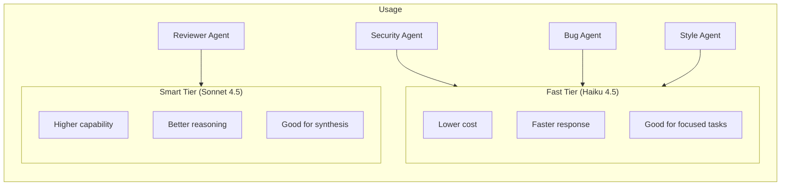

---

## Agent Design Pattern

### Base Agent Architecture

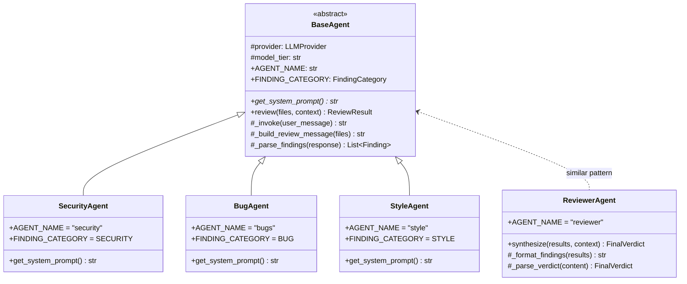

### Agent Lifecycle

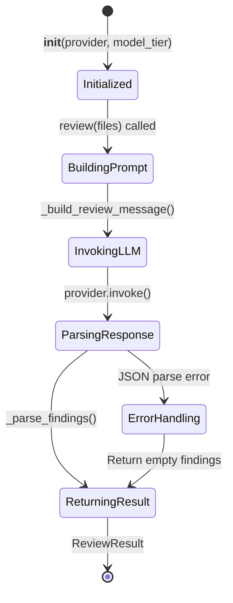

### Template Method Pattern

The `BaseAgent` uses the **Template Method** pattern:

```python
class BaseAgent(ABC):
    @abstractmethod
    def get_system_prompt(self) -> str:
        """Subclasses provide their specialized prompt."""
        raise NotImplementedError

    async def review(self, files, context=None) -> ReviewResult:
        """Template method - same flow for all agents."""
        # 1. Build the message (common)
        user_message = self._build_review_message(files, context)

        # 2. Invoke LLM (common)
        response = await self._invoke(user_message)

        # 3. Parse findings (common)
        findings = self._parse_findings(response)

        return ReviewResult(
            agent_name=self.AGENT_NAME,
            findings=findings,
            files_reviewed=[f["path"] for f in files],
        )
```

---

## Parallel Execution with asyncio

### Why Parallel?

```mermaid
gantt
    title Sequential vs Parallel Execution
    dateFormat X
    axisFormat %s

    section Sequential
    Security Agent    :0, 3
    Bug Agent         :3, 6
    Style Agent       :6, 9
    Reviewer Agent    :9, 11
    Total: 11 seconds :milestone, 11, 0

    section Parallel
    Security Agent    :0, 3
    Bug Agent         :0, 3
    Style Agent       :0, 3
    Reviewer Agent    :3, 5
    Total: 5 seconds  :milestone, 5, 0
```

### asyncio.gather Pattern

```python
# orchestrator.py
async def _review_diff(self, diff, ...):
    # Parse and prepare files
    files_data = [...]

    # Run all agents in PARALLEL using asyncio.gather
    results = await asyncio.gather(
        self.security_agent.review(files_data),  # Coroutine 1
        self.bug_agent.review(files_data),        # Coroutine 2
        self.style_agent.review(files_data),      # Coroutine 3
        return_exceptions=True,  # Don't fail if one agent errors
    )

    # All three complete before this line executes
    # results = [SecurityResult, BugResult, StyleResult]

    # Now run reviewer (must be sequential - needs agent results)
    verdict = await self.reviewer_agent.synthesize(results, context)
```

### Async Flow Visualization

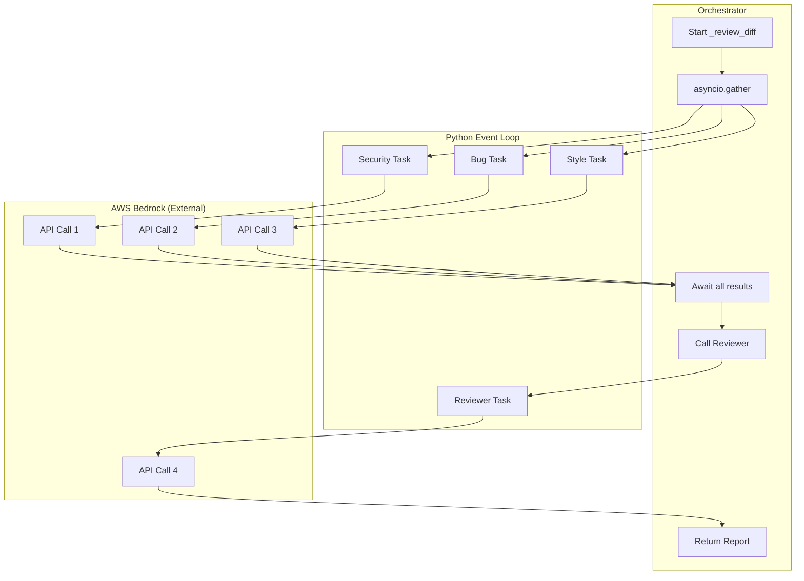

### Key asyncio Concepts

| Concept | Description | Usage in Project |
|---------|-------------|------------------|
| `async def` | Defines a coroutine function | All agent methods |
| `await` | Pauses until coroutine completes | `await provider.invoke()` |
| `asyncio.gather()` | Run multiple coroutines concurrently | Parallel agent execution |
| `return_exceptions=True` | Return exceptions instead of raising | Graceful error handling |
| `asyncio.run()` | Entry point for async code | `asyncio.run(orchestrator.review())` |

---

## The Reviewer Agent: Synthesis Pattern

### What Makes the Reviewer Different?

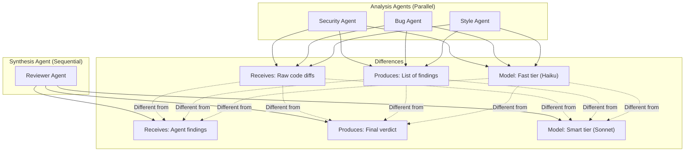

### Synthesis Flow

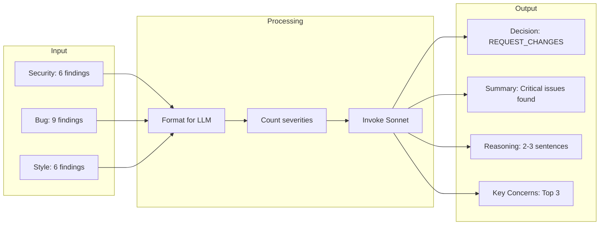

### Decision Logic

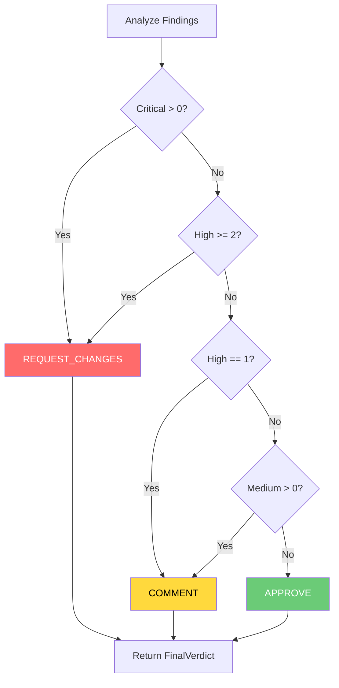

### Structured Output Pattern

The Reviewer expects JSON output from the LLM:

```python
# prompts/reviewer.py
REVIEWER_SYSTEM_PROMPT = """
...
## Response Format

You MUST respond with ONLY a valid JSON object:

{
    "decision": "APPROVE" | "REQUEST_CHANGES" | "COMMENT",
    "summary": "One-line summary of your decision",
    "reasoning": "2-3 sentences explaining your decision",
    "key_concerns": ["concern1", "concern2", "concern3"]
}
"""

# agents/reviewer.py
def _parse_verdict(self, content: str) -> FinalVerdict:
    try:
        # Try to parse JSON
        data = json.loads(content)
        return FinalVerdict(
            decision=ReviewDecision(data["decision"]),
            summary=data.get("summary", ""),
            reasoning=data.get("reasoning", ""),
            key_concerns=data.get("key_concerns", []),
        )
    except (json.JSONDecodeError, KeyError):
        # Fallback: determine from severity counts
        return self._fallback_verdict(content, severity_counts)
```

---

## Prompt Engineering Patterns

### Structured Output Prompts

Each agent's prompt follows a pattern:

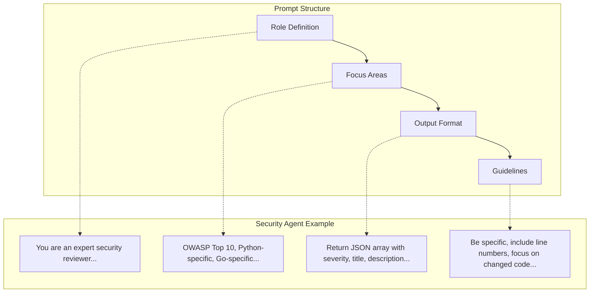

### JSON Output Pattern

```python
# All agents use this JSON structure for findings
OUTPUT_FORMAT = """
Return your findings as a JSON array:
```json
[
  {
    "severity": "critical|high|medium|low",
    "title": "Brief title",
    "description": "Detailed explanation",
    "file_path": "path/to/file.py",
    "line_number": 42,
    "code_snippet": "The problematic code",
    "suggested_fix": "How to fix it"
  }
]
```
If no issues found, return: []
"""
```

### Prompt Specialization

| Agent | Focus | Severity Emphasis |
|-------|-------|-------------------|
| Security | OWASP, injection, secrets | Critical for exploitable vulns |
| Bug | Logic errors, null refs, leaks | High for production crashes |
| Style | Naming, structure, practices | Low/Medium only |
| Reviewer | Synthesis, decision making | Weighs all severities |

---

## Error Handling Strategies

### Graceful Degradation

```mermaid
flowchart TB
    subgraph AgentError["Agent Error Handling"]
        A1[Agent throws exception]
        A2[Caught by gather]
        A3[Converted to ReviewResult with error]
        A4[Other agents continue]
    end

    subgraph ReviewerError["Reviewer Error Handling"]
        R1[JSON parse fails]
        R2[Fallback to severity counting]
        R3[Still produces verdict]
    end

    subgraph ProviderError["Provider Error Handling"]
        P1[Bedrock API error]
        P2[Retry with backoff]
        P3[Return error after retries]
    end

    A1 --> A2 --> A3 --> A4
    R1 --> R2 --> R3
    P1 --> P2 --> P3
```

### Error Handling Code Patterns

```python
# Orchestrator: Handle agent exceptions
results = await asyncio.gather(
    self.security_agent.review(files_data),
    self.bug_agent.review(files_data),
    self.style_agent.review(files_data),
    return_exceptions=True,  # Key: don't fail on one error
)

for result in results:
    if isinstance(result, Exception):
        valid_results.append(ReviewResult(
            agent_name="unknown",
            error=str(result),
        ))
    else:
        valid_results.append(result)

# Reviewer: Fallback verdict
def _parse_verdict(self, content, severity_counts):
    try:
        return FinalVerdict(**json.loads(content))
    except:
        # Fallback: use severity counts to decide
        if severity_counts["critical"] > 0:
            return FinalVerdict(decision=REQUEST_CHANGES, ...)
        # ... more logic
```

---

## Data Models

### Complete Model Hierarchy

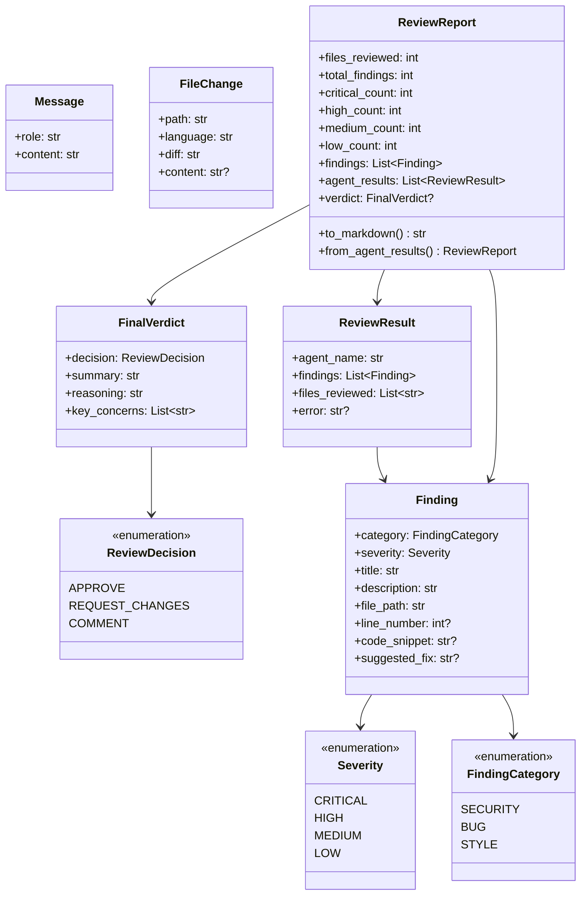

---

## Key Takeaways

### 1. Multi-Agent Architecture Benefits

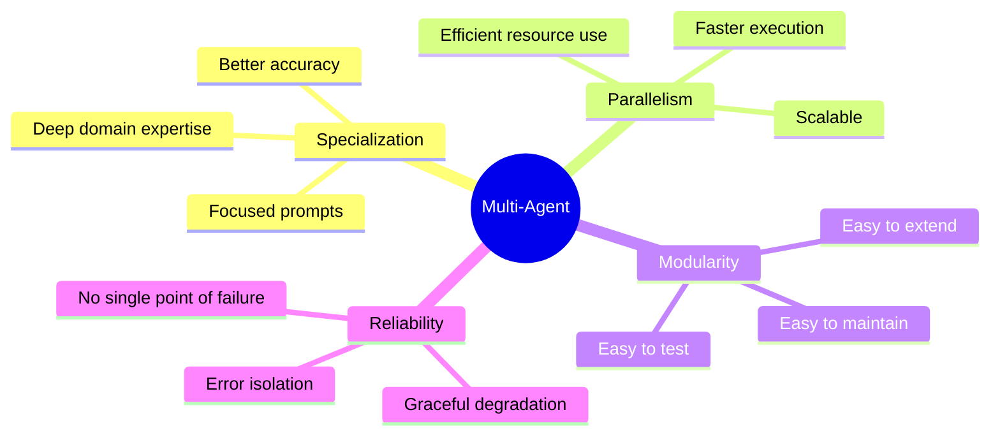

### 2. Key Design Patterns Used

| Pattern | Where Used | Why |
|---------|------------|-----|
| **Protocol** | LLMProvider | Decouple agents from providers |
| **Template Method** | BaseAgent | Common flow, specialized behavior |
| **Factory** | get_provider() | Create providers by type |
| **Strategy** | Model tiers | Switch cost/quality tradeoff |
| **Facade** | Orchestrator | Hide complexity from CLI |

### 3. When to Use This Architecture

**Good for:**
- Tasks with distinct sub-problems (security, style, bugs)
- When specialization improves quality
- When parallel execution saves time
- When you need a final synthesis/decision

**Not ideal for:**
- Simple, single-step tasks
- Tasks requiring deep context sharing between steps
- Very low latency requirements (network overhead)

### 4. Extension Points

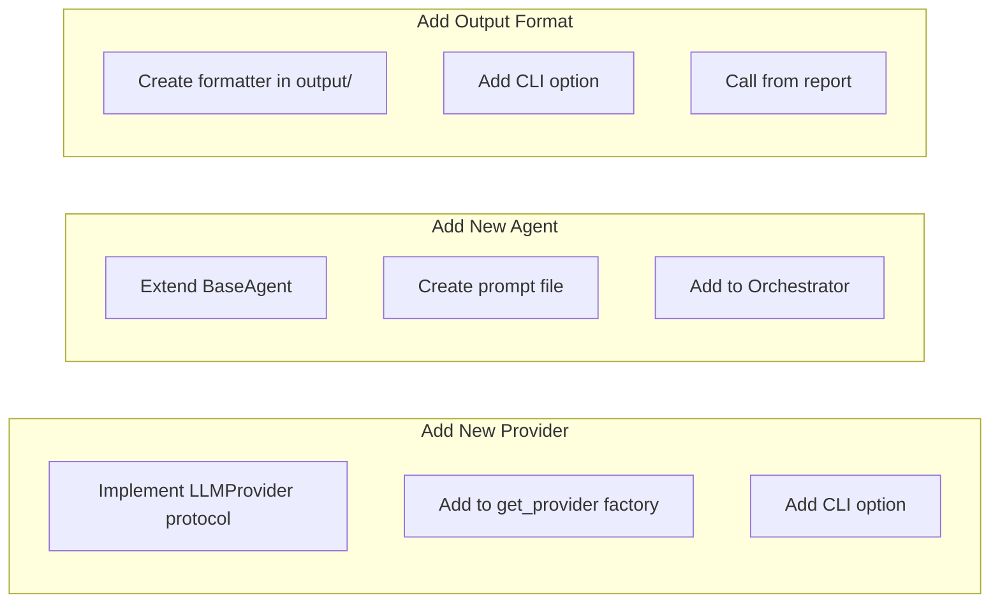

---

## Quick Reference

### File Locations

```
code_reviewer/
├── cli.py              # Entry point, argument parsing
├── orchestrator.py     # Coordinates agents
├── models.py           # Pydantic data models
├── git_utils.py        # Git and GitHub operations
├── agents/
│   ├── base.py         # BaseAgent abstract class
│   ├── security.py     # Security analysis
│   ├── bugs.py         # Bug detection
│   ├── style.py        # Style review
│   └── reviewer.py     # Final synthesis
├── prompts/
│   ├── security.py     # Security prompt
│   ├── bugs.py         # Bug prompt
│   ├── style.py        # Style prompt
│   └── reviewer.py     # Reviewer prompt
├── providers/
│   ├── base.py         # LLMProvider protocol
│   ├── bedrock.py      # AWS Bedrock
│   └── agent_sdk.py    # Future SDK
└── output/
    └── markdown.py     # Report formatting
```

### Command Quick Reference

```bash
# Review a commit
code-review HEAD

# Review a GitHub PR
code-review https://github.com/owner/repo/pull/123

# Review with options
code-review HEAD --verbose --languages python
```

---

## Next Steps

1. **Try it yourself**: Run `code-review` on your own PRs
2. **Add an agent**: Create a `PerformanceAgent` that looks for N+1 queries
3. **Add a provider**: Implement `OpenAIProvider` using the same protocol
4. **Customize prompts**: Adjust prompts for your codebase's patterns
5. **Add tests**: Write unit tests for agents using mocked providers
