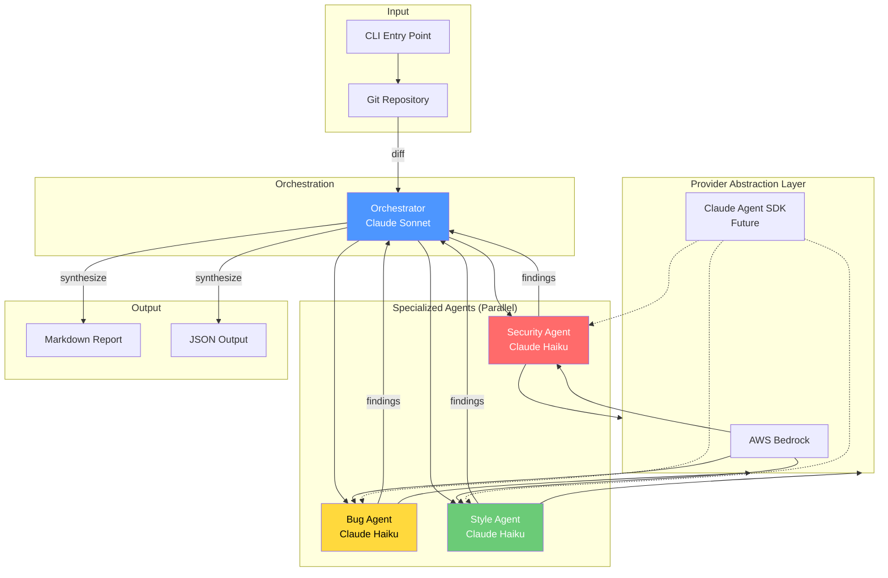
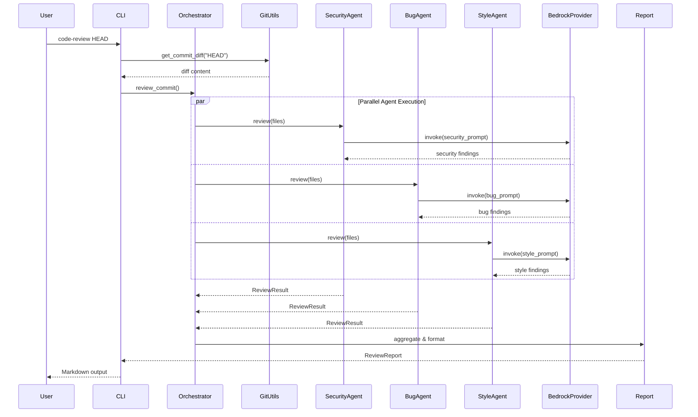
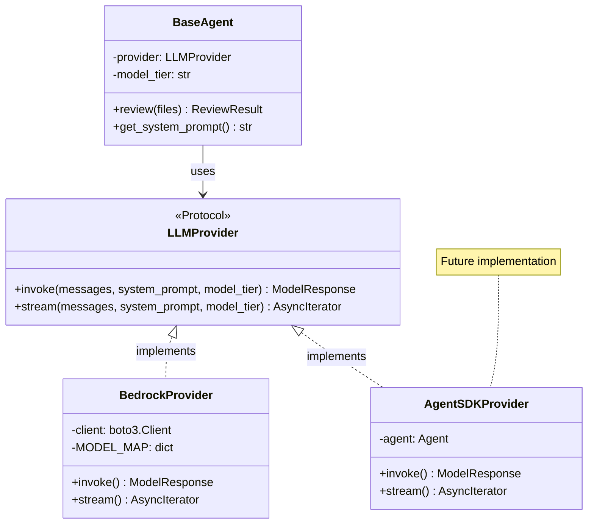
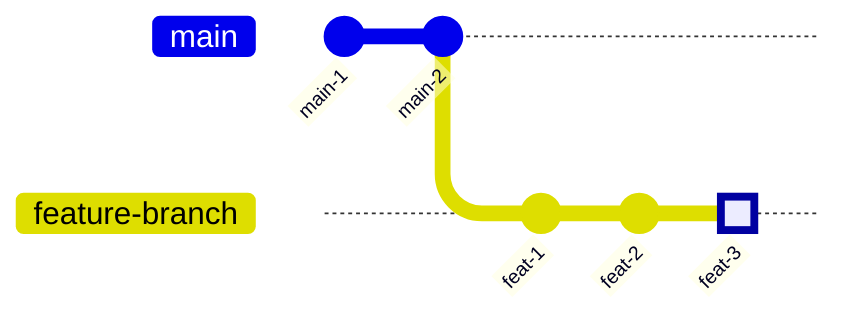
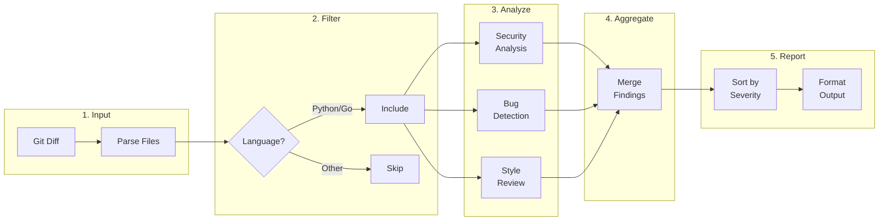
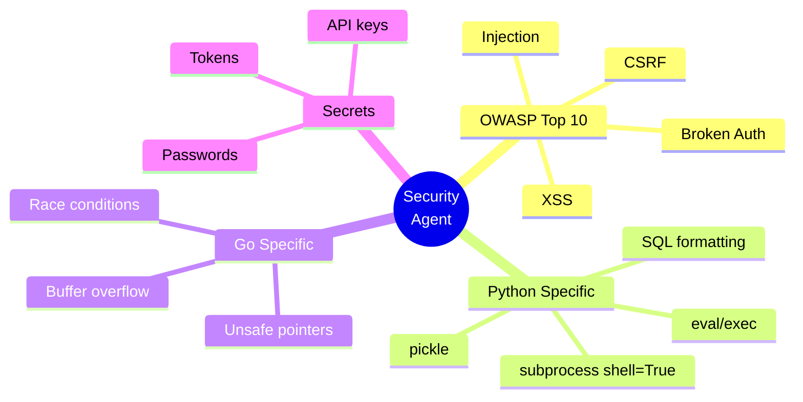
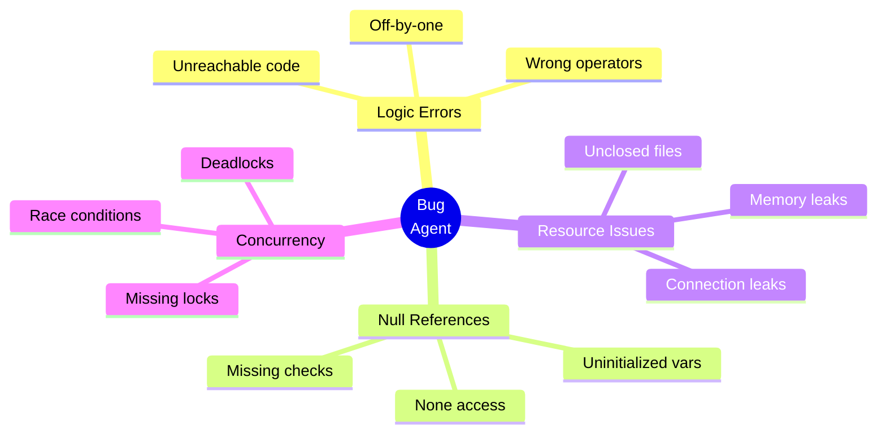
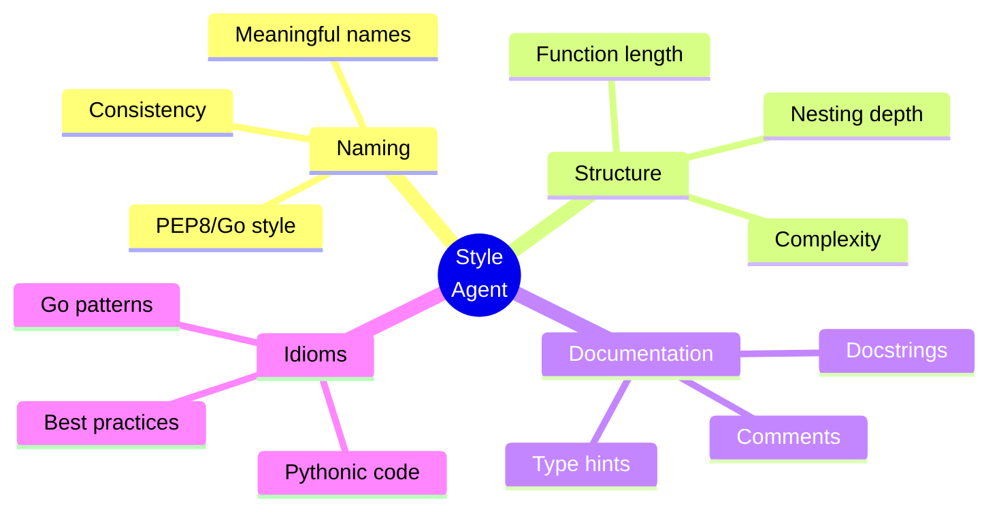

# Multi-Agent Code Review System

A powerful CLI tool that leverages a **multi-agent AI architecture** to perform comprehensive code reviews on git commits and pull requests. Built with extensibility in mind, it uses specialized AI agents for security analysis, bug detection, and code style review—all running in parallel for maximum efficiency.

## Table of Contents

- [Features](#features)
- [Architecture](#architecture)
- [Installation](#installation)
- [Configuration](#configuration)
- [Usage](#usage)
  - [Basic Examples](#basic-examples)
  - [PR Review Workflow](#pr-review-workflow)
  - [Output Formats](#output-formats)
- [How It Works](#how-it-works)
- [Specialized Agents](#specialized-agents)
- [Extensibility](#extensibility)
- [Project Structure](#project-structure)
- [Example Output](#example-output)
- [Contributing](#contributing)
- [License](#license)

---

## Features

### Multi-Agent Architecture
Three specialized AI agents work in parallel, each focused on a specific aspect of code quality:

| Agent | Focus Area | Model |
|-------|------------|-------|
| **Orchestrator** | Synthesis and coordination | Claude Sonnet 4.5 |
| **Security Agent** | Vulnerabilities, OWASP Top 10, secrets detection | Claude Haiku 4.5 |
| **Bug Agent** | Logic errors, null references, resource leaks | Claude Haiku 4.5 |
| **Style Agent** | Naming conventions, best practices, code structure | Claude Haiku 4.5 |

### Key Capabilities

- **Parallel Execution**: All agents run concurrently for fast reviews
- **Git Integration**: Works with commits, branches, and PR diffs
- **GitHub CLI Support**: Review PRs directly from GitHub URLs via `gh` CLI
- **Language Support**: Python and Go (extensible to more)
- **Rich Output**: Markdown reports with severity rankings and suggested fixes
- **Extensible Providers**: Swap between AWS Bedrock and future Claude Agent SDK
- **CI/CD Ready**: Exit codes based on finding severity for pipeline integration

---

## Architecture

### High-Level Overview



### Request Flow



### Provider Abstraction



---

## Installation

### Prerequisites

- Python 3.11+
- AWS account with Bedrock access
- Git

### Setup

```bash
# Clone the repository
git clone <your-repo-url>
cd agentic_coding

# Create virtual environment
python -m venv .venv

# Activate virtual environment
source .venv/bin/activate  # Linux/macOS
# or
.venv\Scripts\activate     # Windows

# Install in development mode
pip install -e .

# Verify installation
code-review --help
```

### Quick Install (pip)

```bash
pip install code-reviewer
```

---

## Configuration

### AWS Credentials

The tool uses AWS Bedrock as the default LLM provider. Configure your AWS credentials:

```bash
# Option 1: Environment variables
export AWS_REGION=us-west-2
export AWS_PROFILE=your-profile

# Option 2: AWS CLI configuration
aws configure --profile your-profile

# Option 3: IAM role (for EC2/ECS/Lambda)
# Automatically detected
```

### Required IAM Permissions

```json
{
    "Version": "2012-10-17",
    "Statement": [
        {
            "Effect": "Allow",
            "Action": [
                "bedrock:InvokeModel",
                "bedrock:InvokeModelWithResponseStream"
            ],
            "Resource": [
                "arn:aws:bedrock:*::foundation-model/anthropic.claude-*"
            ]
        }
    ]
}
```

### Environment Variables

| Variable | Description | Default |
|----------|-------------|---------|
| `AWS_REGION` | AWS region for Bedrock | `us-west-2` |
| `AWS_PROFILE` | AWS profile name | Default profile |

---

## Usage

### Basic Examples

#### Review the Last Commit

```bash
code-review HEAD
```

**What it does:**
1. Gets the diff for the HEAD commit
2. Parses changed Python/Go files
3. Runs security, bug, and style agents in parallel
4. Outputs a markdown report

#### Review a Specific Commit

```bash
code-review abc123f
```

#### Review with Verbose Output

```bash
code-review HEAD --verbose
```

Shows additional details including individual agent results and any errors.

### GitHub PR Review (via gh CLI)

Review pull requests directly from GitHub using the GitHub CLI (`gh`).

#### Prerequisites

Install and authenticate GitHub CLI:
```bash
# Install (macOS)
brew install gh

# Install (other platforms)
# See: https://cli.github.com/

# Authenticate
gh auth login
```

#### Review a GitHub PR by URL

```bash
# Full URL format
code-review https://github.com/owner/repo/pull/123

# Short URL format
code-review github.com/owner/repo/pull/123

# Shorthand format
code-review owner/repo#123
```

**What it does:**
1. Parses the GitHub PR URL
2. Fetches the PR diff using `gh pr diff`
3. Runs all review agents in parallel
4. Outputs a markdown report

#### Example: Review an Open Source PR

```bash
# Review a PR from any public repository
code-review https://github.com/anthropics/claude-code/pull/456

# With verbose output to see PR details
code-review anthropics/claude-code#456 --verbose
```

### Local PR Review Workflow

#### Review Changes Between Branches

```bash
# Review all changes from main to feature-branch
code-review feature-branch --base main
```



The command reviews all commits in the highlighted range (feat-1 through feat-3).

#### Typical PR Workflow

```bash
# 1. Create feature branch
git checkout -b feature/add-user-auth

# 2. Make changes and commit
git add .
git commit -m "Add user authentication"

# 3. Review your changes before pushing
code-review HEAD

# 4. Review all changes vs main before PR
code-review feature/add-user-auth --base main

# 5. If critical issues found (exit code 2), fix them
# 6. Push and create PR
git push origin feature/add-user-auth
```

### Output Formats

#### Markdown (Default)

```bash
code-review HEAD
```

Produces rich, formatted output in the terminal.

#### JSON Output

```bash
code-review HEAD --json-output
```

Useful for CI/CD pipelines and programmatic processing:

```json
{
  "files_reviewed": 3,
  "total_findings": 5,
  "critical_count": 1,
  "high_count": 2,
  "medium_count": 1,
  "low_count": 1,
  "findings": [...]
}
```

#### Filter by Language

```bash
# Only review Python files
code-review HEAD --languages python

# Review Python and Go (default)
code-review HEAD --languages python,go
```

### Exit Codes

| Code | Meaning |
|------|---------|
| 0 | Success - no critical/high issues |
| 1 | High severity issues found |
| 2 | Critical issues found |
| 3 | Error during execution |

Use in CI/CD:

```yaml
# GitHub Actions example
- name: Code Review
  run: |
    code-review HEAD --base main
  continue-on-error: false  # Fails on critical/high issues
```

---

## How It Works

### Processing Pipeline



### Diff Processing

The system processes git diffs through these steps:

1. **Extract Diff**: Get raw diff from git
2. **Parse**: Split into individual file changes
3. **Filter**: Keep only supported languages (Python, Go)
4. **Enrich**: Optionally load full file content for context
5. **Distribute**: Send to all agents in parallel

---

## Specialized Agents

### Security Agent

Focuses on identifying security vulnerabilities:



**Example findings:**
- SQL injection via string formatting
- Hardcoded API keys
- Use of `eval()` with user input
- Insecure deserialization

### Bug Agent

Detects logic errors and potential bugs:



**Example findings:**
- Potential null pointer dereference
- Resource not closed in error path
- Mutable default argument
- Unchecked error return

### Style Agent

Reviews code quality and best practices:



**Example findings:**
- Function too long (>50 lines)
- Missing type hints
- Non-descriptive variable name
- Deep nesting (>3 levels)

---

## Extensibility

### Adding a New Provider

The system uses the **Provider Protocol** pattern for extensibility:

```python
# code_reviewer/providers/my_provider.py
from ..models import Message, ModelResponse
from .base import LLMProvider

class MyProvider:
    """Custom LLM provider implementation."""

    async def invoke(
        self,
        messages: list[Message],
        system_prompt: str,
        model_tier: str = "fast",
    ) -> ModelResponse:
        # Your implementation here
        response = await my_llm_call(messages, system_prompt)
        return ModelResponse(content=response)

    async def stream(self, messages, system_prompt, model_tier="fast"):
        # Streaming implementation
        async for chunk in my_llm_stream(messages):
            yield chunk
```

Then register in `providers/base.py`:

```python
def get_provider(provider_type: str = "bedrock") -> LLMProvider:
    if provider_type == "my-provider":
        from .my_provider import MyProvider
        return MyProvider()
    # ... existing providers
```

### Adding a New Agent

```python
# code_reviewer/agents/performance.py
from ..models import FindingCategory
from .base import BaseAgent

PERFORMANCE_PROMPT = """You are a performance analysis expert..."""

class PerformanceAgent(BaseAgent):
    AGENT_NAME = "performance"
    FINDING_CATEGORY = FindingCategory.BUG  # or create new category

    def get_system_prompt(self) -> str:
        return PERFORMANCE_PROMPT
```

---

## Project Structure

```
agentic_coding/
├── code_reviewer/
│   ├── __init__.py              # Package initialization
│   ├── cli.py                   # CLI entry point (click)
│   ├── orchestrator.py          # Multi-agent coordinator
│   ├── git_utils.py             # Git diff parsing utilities
│   ├── models.py                # Pydantic data models
│   │
│   ├── providers/               # LLM provider abstraction
│   │   ├── __init__.py
│   │   ├── base.py              # LLMProvider Protocol
│   │   ├── bedrock.py           # AWS Bedrock implementation
│   │   └── agent_sdk.py         # Future Claude SDK placeholder
│   │
│   ├── agents/                  # Specialized review agents
│   │   ├── __init__.py
│   │   ├── base.py              # BaseAgent abstract class
│   │   ├── security.py          # Security vulnerability detection
│   │   ├── bugs.py              # Bug and logic error detection
│   │   └── style.py             # Code style and best practices
│   │
│   ├── prompts/                 # System prompts for agents
│   │   ├── __init__.py
│   │   ├── security.py          # Security-focused prompts
│   │   ├── bugs.py              # Bug detection prompts
│   │   ├── style.py             # Style review prompts
│   │   └── orchestrator.py      # Synthesis prompts
│   │
│   └── output/                  # Output formatters
│       ├── __init__.py
│       └── markdown.py          # Markdown report generator
│
├── tests/
│   ├── __init__.py
│   └── fixtures/                # Test data
│       └── sample_diff.txt
│
├── pyproject.toml               # Project configuration
└── README.md                    # This file
```

---

## Example Output

### Sample Review Report

```markdown
# Code Review Report

## Summary
- **Files Reviewed**: 3
- **Critical**: 1 | **High**: 2 | **Medium**: 3 | **Low**: 1
- **Total Findings**: 7

> **Recommendation**: Request changes - critical issues found

---

## Critical Findings

### 1. [SECURITY] SQL Injection Vulnerability
**File**: `api/handlers.py:15`

The query uses string formatting which allows SQL injection attacks.

**Code**:
```python
query = f"SELECT * FROM users WHERE id = {user_id}"
```

**Suggested Fix**:
```python
query = "SELECT * FROM users WHERE id = %s"
cursor.execute(query, (user_id,))
```

---

## High Severity Findings

### 1. [SECURITY] Hardcoded API Key
**File**: `api/handlers.py:45`

API key is hardcoded in source code, which could be exposed in version control.

**Code**:
```python
API_KEY = "sk-1234567890abcdef"
```

**Suggested Fix**:
> Use environment variables: `API_KEY = os.getenv("API_KEY")`

### 2. [BUG] Resource Leak - Connection Not Closed
**File**: `api/handlers.py:38`

Database connection is not closed in the error path.

**Suggested Fix**:
> Use a context manager: `with sqlite3.connect('users.db') as conn:`

---

## Contributing

1. Fork the repository
2. Create a feature branch (`git checkout -b feature/amazing-feature`)
3. Make your changes
4. Run tests (`pytest`)
5. Commit (`git commit -m 'Add amazing feature'`)
6. Push (`git push origin feature/amazing-feature`)
7. Open a Pull Request

---

## License

MIT License - see [LICENSE](LICENSE) for details.

---

## Acknowledgments

- Built with [Claude](https://anthropic.com) by Anthropic
- Powered by [AWS Bedrock](https://aws.amazon.com/bedrock/)
- CLI built with [Click](https://click.palletsprojects.com/) and [Rich](https://rich.readthedocs.io/)
